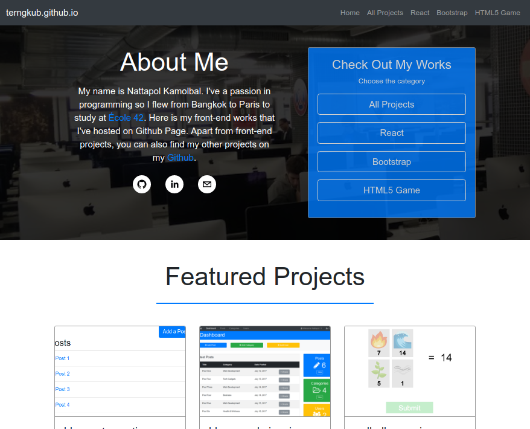

# terngkub.github.io
My front-end portfolio site. Creating by react.js and Boostrap4.

### About the project
This repository is actually the requirement to use GitHub Pages service. However, as time goes by, my front-end projects that I've hosted with GitHub Pages keep growing up and are hard to access so I use this repo as a way to collect and showcase them in one place. I also use it as my front-end portfolio for now.

I created it with react.js and Bootstrap4. I used react-router-dom to make it multiple-page web app.

